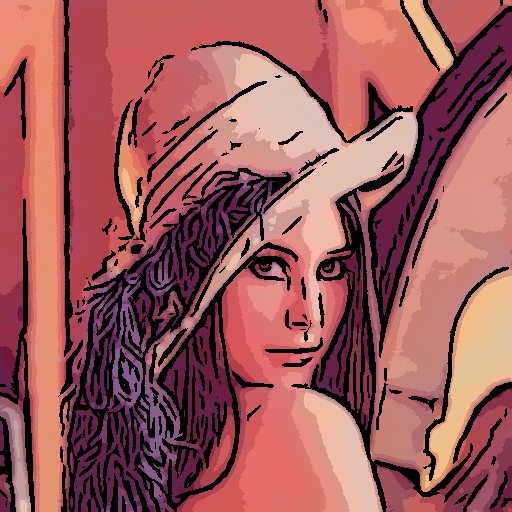

# Stylisation project
This project aim to build NRI (Non Realistic Image) from photographies. It used different algorithms to create painting-like image that you can find in the source code.
# Cartoon abstraction
You can found an exemple of cartooning style in [test.cpp](src/tests.cpp) at the *testAbstraction* function. The result of this filter is illustrated with the two following pictures:



# How does it work?
We wrote a paper that you can find on [doc/flowBasedStructureStylisation_LOHOU-LAURENT.pdf](doc/flowBasedStructureStylisation_LOHOU-LAURENT.pdf)

# Other exemples


## Building the project

Note that the following instructions are only valid for a GNU/Linux OS and only tested on Ubuntu 18.04.
### Prerequisites

1. [CMake](https://cmake.org), at least version 2.8.
2. [Git](https://git-scm.com/).
3. A C++ compiler
4. The [OpenCV library](https://opencv.org/releases/)

### Download the sources

~~~
    $ git clone https://github.com/RandomTony/Stylisation.git
    $ cd Stylisation
~~~

### Build the source

We use CMake to generate a Makefile. For now it build the entire project. You can not generate the makefile from the root of the project to avoid a total mess.
We advice to use the ```cmake``` command from the *build* project :
~~~
    $ mkdir build
    $ cd build
    $ cmake ..
    $ make
~~~
The project outputs will be generated in *bin* folder.
## Ressources
You can find some free ressources inside the [ressources](ressouces) folder. There are classical imaging processing pictures like [lenna](https://en.wikipedia.org/wiki/Lenna). High definition pictures (Full HD, UHD) can be found at [ressources/highDefinitionUnsplash](ressources/highDefinitionUnsplash). Note that if you want to add a picture in these folder you must ensure that you are allowed to do it. Also if you do it, give a credit.
## Contributing
If you want to contribute to this project, you can. Before you should read the [contribution document](CONTRIBUTING.md) and you should know that this project is under [Apache 2.0 licence](LICENSE.md).
